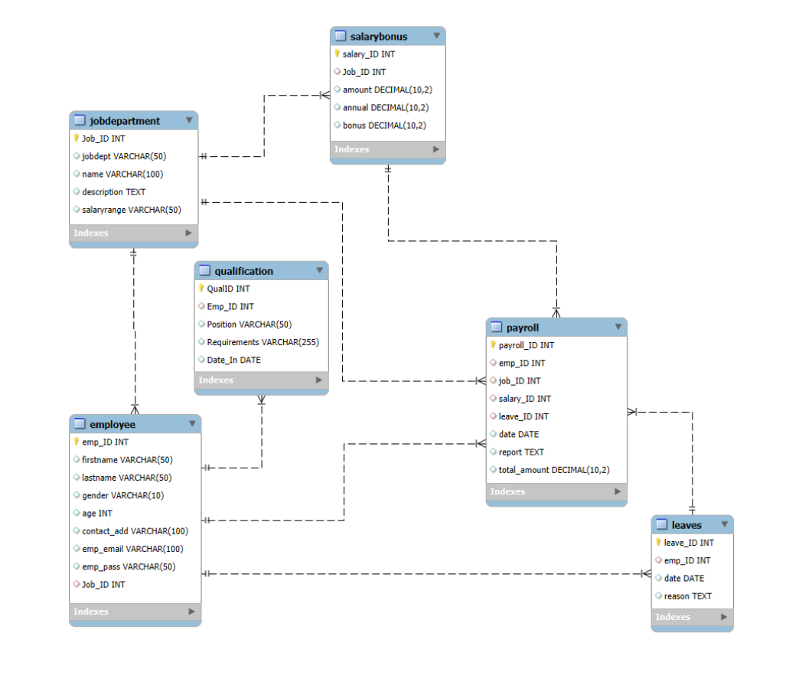

# Employee Management System — SQL Project

A relational database project built with **MySQL** to manage employee information, job roles, departments, salaries, bonuses, qualifications, leaves, and payroll data.

The project demonstrates an end-to-end SQL workflow including **database design, data loading, data cleaning, relational querying, and business-oriented data analysis**.

---

## 📌 Project Overview

The Employee Management System is designed as a structured relational database for storing and analyzing employee-related information.

The project contains six interconnected tables covering:

- Employee information
- Job roles and departments
- Salary and bonus details
- Employee qualifications
- Leave records
- Payroll information

The project also includes dedicated SQL scripts for:

1. Database and table creation
2. Data loading
3. Data cleaning
4. Data analysis

---

## 🎯 Project Objectives

- Design a relational database using MySQL.
- Create tables with primary and foreign key relationships.
- Load CSV datasets into MySQL.
- Perform data inspection and cleaning using SQL.
- Maintain referential integrity between related tables.
- Analyze employee, department, salary, qualification, leave, and payroll data.
- Apply intermediate and advanced SQL concepts.
- Generate business-oriented insights from structured data.

---

## 🛠️ Tech Stack

**Database:** MySQL  
**Query Language:** SQL  
**Data Source:** CSV  
**Data Modeling:** Entity Relationship Diagram (ER Diagram)  
**Documentation:** SQL Scripts, ER Diagram & Project Presentation

---

## 📂 Project Structure

```text
employee_management_system_sql_project/
│
├── data/
│   ├── Employee.csv
│   ├── JobDepartment.csv
│   ├── Salary_Bonus.csv
│   ├── Qualification.csv
│   ├── Leaves.csv
│   └── Payroll.csv
│
├── er_diagram/
│   └── ER_diagram.png
│
├── mysql_file/
│   ├── database_&_table_creation.sql
│   ├── data_loading.sql
│   ├── data_cleaning.sql
│   └── data_analysis.sql
│
├── presentation/
│   └── Project_Presentation.pptx
│
├── project_report/
│   └── employee_management_system_mysql_project_report.pdf
│
├── .gitignore
│
└── README.md
```

### 📁 Folder Description

| Folder / File | Description |
|---|---|
| `data/` | Raw CSV datasets used in the project |
| `er_diagram/` | Entity Relationship Diagram of the database |
| `mysql_file/` | SQL scripts for database creation, data loading, cleaning and analysis |
| `presentation/` | Project presentation |
| `project_report/` | Detailed project report |
| `.gitignore` | Specifies files that should not be tracked by Git |
| `README.md` | Project documentation |

---

# 🗄️ Database Design

The database is named:

```sql
employee_management
```

The database consists of **6 relational tables**.

| Table | Description |
|---|---|
| `JobDepartment` | Stores job roles, departments, descriptions and salary ranges |
| `SalaryBonus` | Stores salary, annual salary and bonus information |
| `Employee` | Stores employee personal and contact information |
| `Qualification` | Stores employee qualification and position requirements |
| `Leaves` | Stores employee leave records |
| `Payroll` | Stores payroll-related information |

---

## 🔗 Entity Relationship Diagram

The project includes an ER diagram representing the relationships between the six tables.



---

## 🔄 Table Relationships

The database uses **Primary Keys and Foreign Keys** to establish relationships between tables.

### JobDepartment → Employee

```text
JobDepartment.Job_ID
        ↓
Employee.Job_ID
```

Each employee is associated with a job/department.

### JobDepartment → SalaryBonus

```text
JobDepartment.Job_ID
        ↓
SalaryBonus.Job_ID
```

Salary and bonus information is associated with a specific job role.

### Employee → Qualification

```text
Employee.emp_ID
        ↓
Qualification.Emp_ID
```

Qualification records are linked to employees.

### Employee → Leaves

```text
Employee.emp_ID
        ↓
Leaves.emp_ID
```

Leave records are associated with employees.

### Payroll Relationships

The `Payroll` table connects payroll information with:

- Employee
- Job Department
- Salary/Bonus
- Leave records

This allows payroll information to be analyzed together with employee and compensation data.

---

# 📊 Dataset Overview

The project contains six CSV datasets.

| Dataset | Records |
|---|---:|
| Employee | 60 |
| JobDepartment | 60 |
| Salary_Bonus | 60 |
| Qualification | 60 |
| Leaves | 60 |
| Payroll | 60 |

### Workforce Summary

- **Total Employees:** 60
- **Departments:** 8
- **Qualification Records:** 60
- **Leave Records:** 60
- **Payroll Records:** 60

---

# 🔄 Project Workflow

The project follows a structured SQL workflow:

```text
CSV Files
    ↓
Database & Table Creation
    ↓
Data Loading
    ↓
Data Inspection
    ↓
Data Cleaning
    ↓
Data Validation
    ↓
SQL Analysis
    ↓
Business Insights
```

---

# 1️⃣ Database & Table Creation

The `database_&_table_creation.sql` script creates the database and all six tables.

The database structure includes:

- Primary Keys
- Foreign Keys
- Unique constraints
- Referential actions
- Appropriate data types

Example:

```sql
CREATE DATABASE employee_management;

USE employee_management;
```

Foreign key relationships are also defined to maintain **referential integrity**.

---

# 2️⃣ Data Loading

The `data_loading.sql` script loads the CSV datasets into their respective MySQL tables using:

```sql
LOAD DATA INFILE
```

The loading process includes:

- CSV delimiter configuration
- Quoted field handling
- Header row exclusion
- Data insertion into relational tables

Example:

```sql
LOAD DATA INFILE 'Employee.csv'
INTO TABLE Employee
FIELDS TERMINATED BY ','
ENCLOSED BY '"'
LINES TERMINATED BY '\n'
IGNORE 1 ROWS;
```

> **Note:** The file path may need to be updated according to the MySQL `secure_file_priv` configuration on your system.

---

# 3️⃣ Data Cleaning

The `data_cleaning.sql` script performs systematic data-quality checks across all tables.

### Cleaning operations include:

- NULL value checks
- Data type inspection
- Removing unnecessary spaces
- Text standardization
- Email cleaning
- Duplicate email detection
- Salary validation
- Bonus validation
- Salary range formatting

### Example — Email Cleaning

```sql
UPDATE Employee
SET emp_email = TRIM(emp_email);

UPDATE Employee
SET emp_email = LOWER(emp_email);
```

Duplicate emails are also checked using:

```sql
SELECT emp_email, COUNT(*)
FROM Employee
GROUP BY emp_email
HAVING COUNT(*) > 1;
```

---

# 4️⃣ SQL Data Analysis

The `data_analysis.sql` script contains business-oriented analytical queries organized into five major sections.

---

## 👥 Section 1 — Employee Insights

Questions addressed include:

- How many employees are currently in the system?
- Which departments have the highest number of employees?
- What is the average salary per department?
- Who are the top 5 highest-paid employees?
- What is the total salary expenditure?

### Key Insight

The organization contains **60 employees**.

Finance and IT have the highest employee counts in the dataset.

The total salary expenditure represented in the salary table is:

```text
₹4,321,000
```

---

# 🏢 Section 2 — Job Role & Department Analysis

This section analyzes:

- Number of job roles per department
- Average salary ranges
- Highest-paying job roles
- Total salary allocation by department

### Key Insight

The **Finance Director** role has the highest base salary in the dataset:

```text
₹170,000
```

Legal and Engineering have the highest department-level average salaries.

---

# 🎓 Section 3 — Qualification & Skills Analysis

This section analyzes employee qualifications and position requirements.

Questions include:

- How many employees have at least one qualification?
- Which positions require the most qualifications?
- Which employees have the highest number of qualifications?

### Key Insight

All **60 employees** have a qualification record in the supplied dataset.

The current dataset contains one qualification record per employee, resulting in a uniform qualification distribution.

---

# 🏖️ Section 4 — Leave & Absence Analysis

The project analyzes:

- Leave activity by year
- Average leave records by department
- Employees with the highest number of leaves
- Total leave records
- Relationship between leave records and payroll

### Key Insight

The dataset contains **60 leave records**, with one leave record associated with each employee.

The available leave data therefore represents a uniform sample rather than a complex real-world absence pattern.

---

# 💰 Section 5 — Payroll & Compensation Analysis

Payroll analysis includes:

- Monthly payroll processed
- Average bonus by department
- Total bonuses by department
- Average payroll amount
- Payroll after leave-related deductions

### Key Results

**April 2024 Total Payroll:**

```text
₹2,778,000
```

**Average Payroll Amount:**

```text
₹46,300
```

Finance has the highest total bonus allocation in the dataset.

---

# 🧠 Advanced SQL Concepts Used

This project goes beyond basic `SELECT` queries and demonstrates several important SQL concepts.

### JOINs

Used to combine data from multiple relational tables.

```sql
SELECT e.emp_ID,
       e.firstname,
       jd.jobdept,
       sb.amount
FROM Employee e
JOIN JobDepartment jd
    ON e.Job_ID = jd.Job_ID
JOIN SalaryBonus sb
    ON jd.Job_ID = sb.Job_ID;
```

---

### GROUP BY

Used for department-level and employee-level aggregation.

```sql
SELECT jd.jobdept,
       COUNT(e.emp_ID) AS total_employees
FROM Employee e
JOIN JobDepartment jd
    ON e.Job_ID = jd.Job_ID
GROUP BY jd.jobdept;
```

---

### Aggregate Functions

The project uses functions such as:

```text
COUNT()
SUM()
AVG()
MAX()
```

for workforce, salary, bonus, leave and payroll analysis.

---

### HAVING

Used to filter grouped results.

```sql
GROUP BY emp_ID
HAVING COUNT(*) > 1;
```

---

### Subqueries

Subqueries are used for comparisons such as identifying employees earning above the average salary.

```sql
SELECT e.emp_ID,
       e.firstname,
       sb.amount
FROM Employee e
JOIN SalaryBonus sb
    ON e.Job_ID = sb.Job_ID
WHERE sb.amount > (
    SELECT AVG(amount)
    FROM SalaryBonus
);
```

---

### Common Table Expressions (CTEs)

CTEs are used to simplify complex analytical queries.

```sql
WITH salary_data AS (
    SELECT e.emp_ID,
           e.firstname,
           e.lastname,
           sb.amount
    FROM Employee e
    JOIN SalaryBonus sb
        ON e.Job_ID = sb.Job_ID
)
SELECT *
FROM salary_data
ORDER BY amount DESC
LIMIT 5;
```

---

### Window Functions

The project uses:

- `RANK()`
- `DENSE_RANK()`
- `PARTITION BY`

Example:

```sql
SELECT jd.jobdept,
       e.emp_ID,
       sb.amount,
       RANK() OVER (
           PARTITION BY jd.jobdept
           ORDER BY sb.amount DESC
       ) AS dept_rank
FROM Employee e
JOIN JobDepartment jd
    ON e.Job_ID = jd.Job_ID
JOIN SalaryBonus sb
    ON jd.Job_ID = sb.Job_ID;
```

This allows employees to be ranked according to salary **within their respective departments**.

---

# 📈 Key Business Insights

| Area | Insight |
|---|---|
| Workforce | 60 employees are present in the system |
| Departments | 8 departments are represented |
| Employee Count | Finance and IT have the highest employee counts |
| Highest-Paid Role | Finance Director |
| Highest Base Salary | ₹170,000 |
| Highest Average Salary Department | Legal |
| Salary Expenditure | ₹4,321,000 |
| April 2024 Payroll | ₹2,778,000 |
| Average Payroll | ₹46,300 |
| Qualification Coverage | 60/60 employees have qualification records |
| Leave Records | 60 records |

---

# ⚠️ Data Model Considerations

Although this project successfully demonstrates SQL concepts, some areas could be improved for a production-level HR system.

### 1. Salary Modeling

Salary information is associated with `Job_ID`, meaning salary is modeled primarily at the job level.

A production system could introduce:

```text
EmployeeSalaryHistory
```

to track individual salary changes over time.

### 2. Department & Job Normalization

`JobDepartment` currently contains both department and job-role information.

A more normalized design could separate:

```text
Department
    ↓
JobRole
    ↓
Employee
```

### 3. Payroll History

The current dataset focuses on April 2024 payroll.

Adding multiple months and years would enable:

- Payroll trends
- Year-over-year comparisons
- Monthly salary analysis
- Bonus trends
- Employee compensation history

### 4. Leave Data

The current dataset contains one leave record per employee.

A larger real-world dataset would provide better opportunities for:

- Absenteeism analysis
- Department-level leave trends
- Leave frequency analysis
- Leave-to-payroll relationships

### 5. Security

The project contains an employee password field for demonstration purposes.

In a production application, passwords should **never be stored as plaintext**.

A secure authentication system should use:

- Password hashing
- Salted hashes
- Secure authentication services
- Proper access control

---

# 🚀 Future Enhancements

Possible improvements include:

- [ ] Normalize Department and JobRole tables
- [ ] Add Employee Salary History
- [ ] Add Attendance Management
- [ ] Add Leave Balance tracking
- [ ] Add multiple payroll periods
- [ ] Add payroll deductions and tax information
- [ ] Add CHECK constraints
- [ ] Add indexes for frequently joined columns
- [ ] Add SQL Views for recurring reports
- [ ] Add Stored Procedures
- [ ] Expand dataset across multiple years
- [ ] Build a Power BI HR Dashboard

---

# 📁 SQL Scripts

The project contains four main SQL scripts.

| Script | Purpose |
|---|---|
| `database_&_table_creation.sql` | Creates database, tables and relationships |
| `data_loading.sql` | Loads CSV data into MySQL |
| `data_cleaning.sql` | Performs data inspection and cleaning |
| `data_analysis.sql` | Performs SQL analysis and generates insights |

---

# ▶️ How to Run the Project

### Step 1 — Clone the Repository

```bash
git clone <your-repository-url>
```

### Step 2 — Open MySQL

Open the project using:

- MySQL Workbench
- MySQL Command Line
- Another MySQL-compatible SQL client

### Step 3 — Create Database & Tables

Run:

```text
mysql_file/database_&_table_creation.sql
```

### Step 4 — Load Data

Run:

```text
mysql_file/data_loading.sql
```

> Make sure the CSV paths are correctly configured according to your MySQL environment.

### Step 5 — Clean the Data

Run:

```text
mysql_file/data_cleaning.sql
```

### Step 6 — Perform Analysis

Run:

```text
mysql_file/data_analysis.sql
```

---

# 📚 What This Project Demonstrates

This project demonstrates practical understanding of:

```text
SQL
│
├── Database Creation
├── Table Design
├── Primary Keys
├── Foreign Keys
├── Referential Integrity
├── CSV Data Loading
├── Data Cleaning
├── Data Validation
├── JOINs
├── GROUP BY
├── HAVING
├── Aggregate Functions
├── Subqueries
├── CTEs
├── Window Functions
├── RANK()
├── DENSE_RANK()
├── PARTITION BY
├── String Functions
└── Date Functions
```

---

# 🎯 Project Outcome

The Employee Management System demonstrates how SQL can be used to transform raw employee-related datasets into a structured relational database and then extract meaningful business insights through analytical queries.

The project provides hands-on experience with the complete SQL workflow:

**Database Design → Data Loading → Data Cleaning → Data Analysis → Business Insights**

---

## 👨‍💻 Author

**Afroz Shams**

Data Analyst | SQL | Python | Excel | Power BI | Machine Learning

---

⭐ If you found this project useful, feel free to explore the SQL scripts and analysis queries included in the repository.
